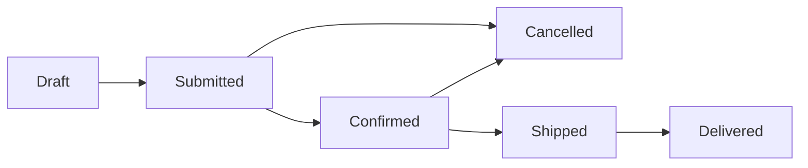
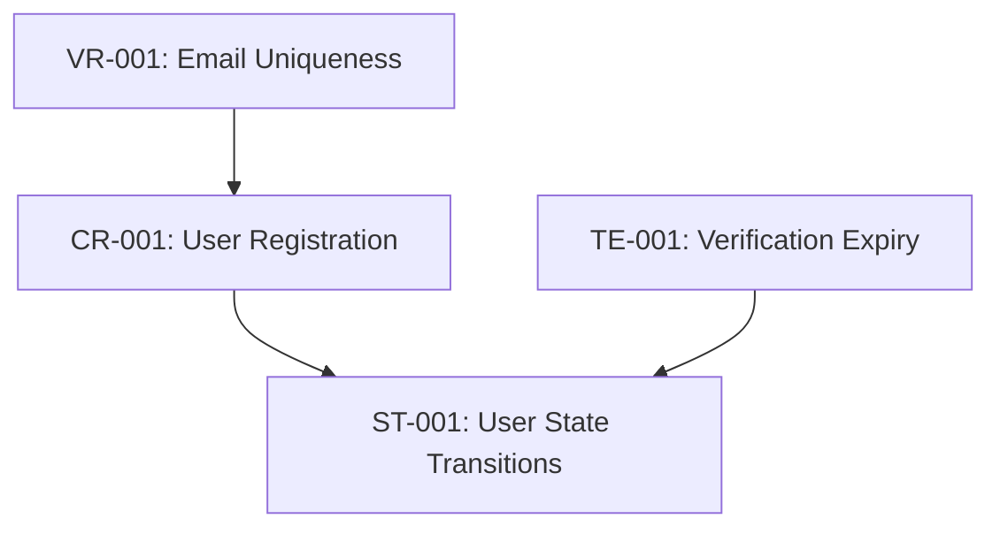

# {project_id} Business Rules (核心業務規則)

> **Purpose**: Document core business rules and constraints that govern {project_name}. These rules are domain-invariants that must always be enforced.

**Last Updated**: {ISO timestamp}
**Maintained By**: Development Team + atdd-knowledge-curator

---

## How to Use This Document

- **For Developers**: Reference when implementing business logic
- **For AI Agents**: Load to understand constraints before code generation
- **For Testing**: Use as source for test case generation
- **For Updates**: Use atdd-knowledge-curator to propose new rules

---

## Rule Categories

### 1. Validation Rules (資料驗證規則)

#### Rule: {RuleName}
**ID**: `VR-{number}` (e.g., VR-001)
**Domain**: {DomainName}
**Description**: {Clear description of the rule}

**Condition**: {When this rule applies}

**Validation Logic**:
```{language}
// Pseudocode or actual code snippet
if ({condition}) {
  throw ValidationError("{error message}");
}
```

**Error Message**: "{User-facing error message}"

**Enforcement Location**:
- {Entity/Service class}: {Specific method}
- {File path}: {Line reference or method name}

**Test Coverage**:
- [ ] Positive case (valid input)
- [ ] Negative case (invalid input)
- [ ] Edge cases

**Examples**:
```
✅ Valid: {Example of valid input}
❌ Invalid: {Example of invalid input} → {Error}
```

**Related Rules**: {Link to related rules}

---

### 2. Constraint Rules (約束條件規則)

#### Rule: {RuleName}
**ID**: `CR-{number}` (e.g., CR-001)
**Domain**: {DomainName}
**Description**: {Clear description of the constraint}

**Constraint Type**: [Uniqueness | Range | Dependency | Cardinality | Temporal]

**Validation Logic**:
```{language}
// Implementation
```

**Database Constraints**:
```sql
-- Database-level enforcement
ALTER TABLE {table_name}
ADD CONSTRAINT {constraint_name}
CHECK ({condition});
```

**Application-level Enforcement**: {Where in code}

**Exceptions**: {When this constraint can be relaxed, if ever}

**Examples**:
```
✅ Allowed: {Example}
❌ Forbidden: {Example} → {Why}
```

---

### 3. State Transition Rules (狀態轉換規則)

#### Rule: {EntityName} State Transitions
**ID**: `ST-{number}` (e.g., ST-001)
**Domain**: {DomainName}
**Entity**: {EntityName}

**States**: {List all possible states}

**Valid Transitions**:


**Transition Rules**:

| From State | To State | Condition | Triggered By | Side Effects |
|------------|----------|-----------|--------------|--------------|
| Draft | Submitted | Must have ≥ 1 item | User action | Publish OrderSubmitted event |
| Submitted | Confirmed | Payment authorized | Payment system | Reserve inventory |
| Submitted | Cancelled | User request OR timeout | User/System | Release inventory, Refund |

**Forbidden Transitions**:
- ❌ Delivered → Draft (Cannot revert completed order)
- ❌ Cancelled → Confirmed (Cannot confirm cancelled order)

**Implementation**:
```{language}
class {EntityName} {
  transitionTo(newState: State): void {
    if (!this.canTransitionTo(newState)) {
      throw new InvalidStateTransitionError(
        `Cannot transition from ${this.state} to ${newState}`
      );
    }
    this.state = newState;
    this.publishStateChangeEvent();
  }
}
```

---

### 4. Calculation Rules (計算規則)

#### Rule: {CalculationName}
**ID**: `CA-{number}` (e.g., CA-001)
**Domain**: {DomainName}
**Description**: {What is being calculated}

**Formula**:
```
{Mathematical formula or business calculation}
```

**Inputs**:
- {Input 1}: {Description and constraints}
- {Input 2}: {Description and constraints}

**Output**:
- {Output}: {Description and constraints}

**Precision**: {Decimal places, rounding rules}

**Edge Cases**:
- {Edge case 1}: {How to handle}
- {Edge case 2}: {How to handle}

**Implementation**:
```{language}
function calculate{Name}({params}): {ReturnType} {
  // Implementation with comments
  const result = {calculation};
  return roundToPrecision(result, {precision});
}
```

**Examples**:
```
Input: {example input}
Calculation: {step-by-step}
Output: {result}
```

**Test Cases**:
- [ ] Normal case
- [ ] Zero values
- [ ] Negative values
- [ ] Large values
- [ ] Precision/rounding

---

### 5. Authorization Rules (授權規則)

#### Rule: {PermissionName}
**ID**: `AU-{number}` (e.g., AU-001)
**Domain**: {DomainName}
**Action**: {What action is being authorized}

**Allowed Roles**: {List of roles that can perform this action}

**Conditions**:
```{language}
// Authorization logic
canPerform({action}, user, resource): boolean {
  return user.hasRole({role}) &&
         {additional conditions};
}
```

**Ownership Rules**: {Resource ownership requirements}

**Context Checks**: {Additional context that must be verified}

**Error Handling**: {What happens when authorization fails}

**Examples**:
```
✅ Allowed: Admin user can delete any order
✅ Allowed: User can delete own draft order
❌ Forbidden: User cannot delete another user's order
❌ Forbidden: Cannot delete submitted order
```

---

### 6. Temporal Rules (時間規則)

#### Rule: {TemporalRuleName}
**ID**: `TE-{number}` (e.g., TE-001)
**Domain**: {DomainName}
**Description**: {Time-based rule description}

**Time Constraints**:
- **Duration**: {How long something is valid/active}
- **Deadline**: {When something must happen}
- **Interval**: {How often something can happen}

**Enforcement**:
```{language}
// Time validation logic
if (currentTime > expirationTime) {
  throw new ExpiredError("{message}");
}
```

**Timezone Handling**: {How timezones are handled}

**Grace Period**: {If applicable}

**Examples**:
```
Scenario: Email verification link
Valid for: 24 hours
Created at: 2025-12-09T10:00:00Z
Expires at: 2025-12-10T10:00:00Z
Accessed at: 2025-12-09T15:00:00Z → ✅ Valid
Accessed at: 2025-12-11T11:00:00Z → ❌ Expired
```

---

## Cross-Domain Rules

### Rule: {CrossDomainRuleName}
**ID**: `CD-{number}` (e.g., CD-001)
**Domains Involved**: {Domain 1}, {Domain 2}
**Description**: {Rule spanning multiple domains}

**Coordination Mechanism**: [Event | API Call | Shared Data]

**Consistency Model**: [Strong | Eventual]

**Failure Handling**: {What happens if one domain fails}

**Example**:
```
Order Domain → Payment Domain
When: Order is submitted
Action: Payment must be authorized
If Payment Fails: Order transitions to Failed state
Compensation: Send OrderFailed event
```

---

## Rule Dependencies



---

## Rule Conflicts and Resolutions

### Conflict: {ConflictDescription}
**Rules Involved**: {Rule IDs}
**Resolution**: {How the conflict is resolved}
**Priority**: {Which rule takes precedence}

---

## Testing Strategy

### Rule Coverage Requirements
- [ ] All validation rules have positive and negative tests
- [ ] All state transitions have tests
- [ ] All calculation rules have precision tests
- [ ] All authorization rules have permission tests
- [ ] All temporal rules have timing tests

### Test Generation
Use `atdd-test-generator` with this document as input to generate comprehensive test suites.

---

## Maintenance Log

| Date | Rule ID | Change | Changed By |
|------|---------|--------|------------|
| {ISO date} | - | Initial business rules created | {name/agent} |
| {ISO date} | VR-001 | Added email validation rule | {name/agent} |
