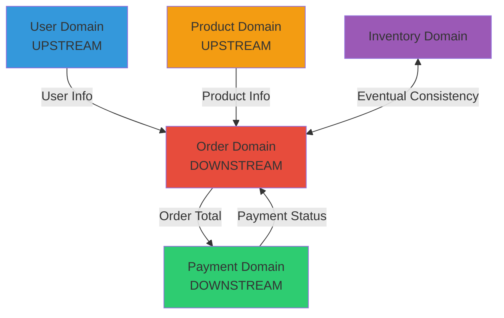
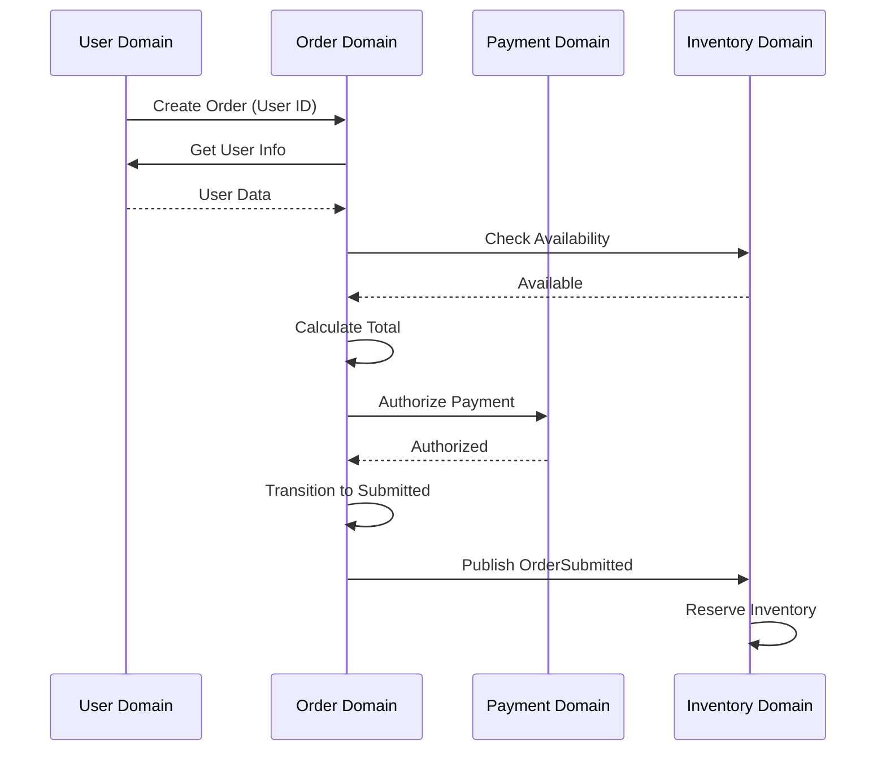
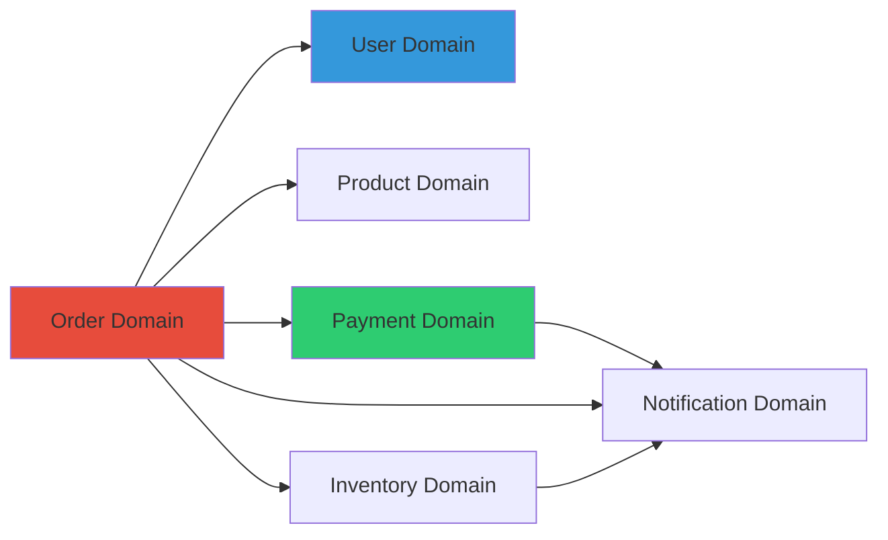

# {project_id} Domain Map (領域邊界和關係圖)

> **Purpose**: Visualize domain boundaries, relationships, and context mapping for {project_name}. This map helps understand how different parts of the system interact.

**Last Updated**: {ISO timestamp}
**Maintained By**: Development Team + atdd-knowledge-curator

---

## How to Use This Document

- **For Developers**: Understand domain boundaries and integration points
- **For AI Agents**: Load before cross-domain tasks to understand relationships
- **For Architects**: Reference for architectural decisions
- **For Updates**: Use atdd-knowledge-curator to propose changes

---

## Domain Overview

### All Domains

| Domain | Type | Team Owner | Path | Status |
|--------|------|------------|------|--------|
| {Domain1} | Core | {Team} | `src/domains/{domain1}` | Active |
| {Domain2} | Supporting | {Team} | `src/domains/{domain2}` | Active |
| {Domain3} | Generic | {Team} | `src/domains/{domain3}` | Active |

**Domain Types**:
- **Core**: Business differentiator, core competency
- **Supporting**: Necessary but not differentiating
- **Generic**: Off-the-shelf, commodity functionality

---

## Domain Boundaries

### Domain: {DomainName}

**Type**: [Core | Supporting | Generic]

**Business Capability**: {What business function this domain supports}

**Bounded Context**: {Explicit boundary description}

**Responsibilities**:
- {Responsibility 1}
- {Responsibility 2}
- {Responsibility 3}

**Key Entities**:
- {Entity1} (Aggregate Root)
- {Entity2}
- {Entity3}

**Key Services**:
- {Service1}: {Purpose}
- {Service2}: {Purpose}

**Data Ownership**:
- Tables: `{table1}`, `{table2}`
- Collections: `{collection1}`

**API Surface**:
- Public APIs: {List public interfaces}
- Events Published: {List domain events}
- Events Subscribed: {List events from other domains}

**Includes** (範疇內):
- {What is explicitly inside this domain}

**Excludes** (範疇外):
- {What is explicitly outside this domain}

**Code Location**: `{path to domain code}`

---

## Domain Relationships

### Context Mapping



### Relationship Patterns

#### Pattern: Customer-Supplier (客戶-供應商)
**Upstream**: {UpstreamDomain}
**Downstream**: {DownstreamDomain}

**Description**: Downstream depends on upstream. Upstream provides service to downstream.

**Contract**:
- Upstream exposes: {API/Events}
- Downstream consumes: {API/Events}

**SLA**: {Service level agreement, if any}

**Example**:
```
User Domain (Upstream) → Order Domain (Downstream)
Order needs user info, but User domain doesn't care about orders
User provides: getUserById() API
Order consumes: User data for order creation
```

---

#### Pattern: Conformist (順從者)
**Upstream**: {UpstreamDomain}
**Downstream**: {DownstreamDomain}

**Description**: Downstream conforms to upstream's model without translation.

**Why Conformist**: {Reason - e.g., third-party API, legacy system}

**Trade-offs**:
- ✅ Advantage: {Benefit}
- ❌ Disadvantage: {Cost}

**Example**:
```
External Payment Gateway (Upstream) → Payment Domain (Downstream)
Payment domain uses gateway's model directly
No translation layer because gateway is stable and well-designed
```

---

#### Pattern: Anti-Corruption Layer (防腐層)
**Upstream**: {UpstreamDomain}
**Downstream**: {DownstreamDomain}

**Description**: Downstream protects itself from upstream's model changes through translation layer.

**ACL Location**: `{path to ACL code}`

**Translation Mappings**:
```typescript
// Upstream model → Domain model
class {ACLName} {
  toDomainModel(upstreamData: UpstreamType): DomainType {
    return {
      // Translation logic
      domainField: upstreamData.externalField,
      // ...
    };
  }

  toUpstreamModel(domainData: DomainType): UpstreamType {
    return {
      // Reverse translation
      externalField: domainData.domainField,
      // ...
    };
  }
}
```

**Why ACL Needed**: {Reason - e.g., legacy system, unstable external API}

**Example**:
```
Legacy ERP System (Upstream) → Order Domain (Downstream)
OrderERPAdapter translates:
- ERP's "ORDNO" → Order's "orderId"
- ERP's "AMT" → Order's "totalAmount"
- ERP's status codes → Order's OrderStatus enum
```

---

#### Pattern: Shared Kernel (共享核心)
**Domains Sharing**: {Domain1}, {Domain2}

**Description**: Small subset of domain model shared between bounded contexts.

**Shared Components**: {List shared code}

**Shared Location**: `{path to shared code}`

**Coordination**: {How changes are coordinated}

**Warning**: ⚠️ Use sparingly! Shared kernel creates coupling.

**Example**:
```
Order Domain ←→ Billing Domain
Shared: Money value object (amount + currency)
Location: src/shared/value-objects/Money.ts
Coordination: Both teams must approve changes
```

---

#### Pattern: Partnership (合作關係)
**Domains**: {Domain1}, {Domain2}

**Description**: Two domains evolve together with mutual dependency.

**Coordination Mechanism**: {How teams coordinate}

**Joint Ownership**: {What is jointly owned}

**Example**:
```
Order Domain ←→ Inventory Domain
Partnership because:
- Order submission triggers inventory reservation
- Inventory changes affect order availability
Teams coordinate: Daily standup + Shared Slack channel
```

---

#### Pattern: Published Language (發布語言)
**Publisher**: {Domain}
**Consumers**: {List of consuming domains}

**Description**: Well-documented, stable model published for others to consume.

**Format**: [JSON Schema | Protocol Buffers | OpenAPI | GraphQL Schema]

**Schema Location**: `{path to schema files}`

**Versioning Strategy**: {How versions are managed}

**Example**:
```
Product Domain publishes:
- Event: ProductCreated
- Schema: JSON Schema v1.0
- Consumers: Order Domain, Search Domain, Analytics Domain
Versioning: Semantic versioning, backward compatible
```

---

## Integration Patterns

### Synchronous Integration (同步整合)

| From Domain | To Domain | Method | Endpoint/Method | Timeout |
|-------------|-----------|--------|-----------------|---------|
| Order | User | REST API | GET /users/{id} | 5s |
| Order | Payment | gRPC | ProcessPayment() | 10s |

**Failure Handling**:
- Timeout: {What happens}
- Service Down: {Fallback strategy}
- Invalid Response: {Error handling}

---

### Asynchronous Integration (非同步整合)

| Publisher | Event Name | Subscribers | Delivery | Retry |
|-----------|------------|-------------|----------|-------|
| Order | OrderSubmitted | Payment, Inventory, Notification | At-least-once | 3x with backoff |
| Payment | PaymentCompleted | Order, Billing | At-least-once | 5x with backoff |

**Event Schema Location**: `{path to event schemas}`

**Event Bus**: [RabbitMQ | Kafka | AWS SNS/SQS | Redis Streams]

**Ordering Guarantees**: {Ordering semantics}

**Idempotency**: {How duplicate events are handled}

---

## Data Flow Diagrams

### Use Case: {UseCaseName}



**Steps**:
1. {Step 1 description}
2. {Step 2 description}
3. {Step 3 description}

**Domain Responsibilities**:
- **User Domain**: {What it does in this flow}
- **Order Domain**: {What it does in this flow}
- **Payment Domain**: {What it does in this flow}

---

## Dependency Graph



**Dependency Analysis**:
- **Highly Depended Upon**: {Domains that many others depend on}
- **Highly Dependent**: {Domains that depend on many others}
- **Independent**: {Domains with few dependencies}

**Cyclic Dependencies**: {List any cycles and how they're broken}

---

## Domain Complexity Matrix

| Domain | Code Complexity | Business Complexity | Change Frequency | Team Size |
|--------|----------------|---------------------|------------------|-----------|
| {Domain1} | High | High | High | 5 |
| {Domain2} | Low | Medium | Low | 2 |
| {Domain3} | Medium | Low | Medium | 3 |

**Scoring**:
- Complexity: Low (1-3) | Medium (4-6) | High (7-10)
- Change Frequency: Low (< 1/month) | Medium (1-4/month) | High (> 4/month)

---

## Evolution Strategy

### Planned Changes

#### Change: {ChangeName}
**Target Domain**: {DomainName}
**Reason**: {Why this change is needed}
**Impact**: {Which other domains are affected}
**Timeline**: {Expected completion}
**Migration Strategy**: {How to transition}

---

### Technical Debt

#### Debt: {DebtDescription}
**Location**: {Domain/Component}
**Impact**: {How it affects development}
**Resolution**: {Plan to address}
**Priority**: [High | Medium | Low]

---

## Best Practices

### Domain Isolation
- ✅ Each domain has its own database schema/tables
- ✅ No direct database access across domains
- ✅ Use APIs or events for cross-domain communication
- ❌ Avoid shared mutable state

### Dependency Management
- ✅ Minimize cross-domain dependencies
- ✅ Use anti-corruption layers for external systems
- ✅ Publish stable contracts for consuming domains
- ❌ Avoid circular dependencies

### Event-Driven Design
- ✅ Use domain events for loose coupling
- ✅ Ensure events are business-meaningful
- ✅ Version events properly
- ❌ Don't use events for synchronous request/response

---

## Maintenance Log

| Date | Change | Changed By |
|------|--------|------------|
| {ISO date} | Initial domain map created | {name/agent} |
| {ISO date} | Added {Domain} domain | {name/agent} |
| {ISO date} | Updated {Domain1} → {Domain2} relationship | {name/agent} |
